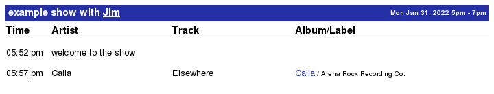

## Example Zookeeper Online JSON:API playlist creation

The following example illustrates dynamic playlist creation, where
we create an empty playlist and add events to it.

If you want to create a playlist and all its events in a single
request, see [this example](PlaylistImport.md).

Note that for the following example, if the show date and time
encompass 'now', the server will automatically timestamp the events.

Playlist creation requires a valid API Key, which you can manage from
within the application (Edit Profile > Manage API Keys).

If you belong to 'v' group, you may create playlists on behalf of
other users: You will own the list in these cases (i.e., can update or
delete them), but they will display publicly under the other user's
airname.

### <a id="show"></a> Create the show:
---
````
POST /api/v2/playlist HTTP/1.1
X-APIKEY: eb5e0e0b42a84531af5f257ed61505050494788d
Content-Type: application/vnd.api+json

{
  "data": {
    "type": "show",
    "attributes": {
      "name": "example show",
      "date": "2022-01-31",
      "time": "1700-1900",
      "airname": "Jim"
    }
  }
}
````
---
### The server responds:
---
````
HTTP/1.1 201 Created
Location: /api/v2/playlist/628
Content-Length: 0
````
---

Upon successful playlist creation, the server returns HTTP code `201
Created`, together with a response header `Location` that identifies
the newly created playlist resource.  This is the expected response,
per [section 7.1.2.1](https://jsonapi.org/format/#crud-creating-responses)
of the JSON:API specification.

The value of `Location` is used as the base for the subsequent requests.


### <a id="eventComment"></a> Add a comment:
---
````
POST /api/v2/playlist/628/events HTTP/1.1
X-APIKEY: eb5e0e0b42a84531af5f257ed61505050494788d
Content-Type: application/vnd.api+json

{
  "data": {
    "type": "event",
    "attributes": {
      "type": "comment",
      "comment": "welcome to the show"
    }
  }
}
````
---
### The server responds:
---
````
HTTP/1.1 200 OK
Content-Type: application/vnd.api+json

{
  "data": {
    "type": "event",
    "id": "7425"
  }
}
````
---

For successfully added events, the server returns HTTP status code
`200 OK`.  The response body contains a resource object with the id of
the created event.  This conforms to the semantics of JSON:API v1.0
section 7.3.

### <a id="eventSpin"></a> Add a spin:
---
````
POST /api/v2/playlist/628/events HTTP/1.1
X-APIKEY: eb5e0e0b42a84531af5f257ed61505050494788d
Content-Type: application/vnd.api+json

{
  "data": {
    "type": "event",
    "attributes": {
      "type": "spin",
      "artist": "Calla",
      "track": "Elsewhere",
      "album": "Calla",
      "label": "Arena Rock Recording Co."
    },
    "relationships": {
      "album": {
        "data": {
          "type": "album",
          "id": "1060007"
        }
      }
    }
  }
}
````
---
Use `relationships` as illustrated above to link to a Zookeeper Online album.
The album id is the tag number.

Linking in this way places a hyperlink in your playlist to the
Zookeeper Online album.  As well, it ensures the spin counts toward charting,
if the album is in the A-File.

**Tip:** If you link to an album in this way, you need supply only the
'type' and 'track' attributes; the artist, album, and label will be
populated automatically based on the linkage.


### The server responds:
---
````
HTTP/1.1 200 OK
Content-Type: application/vnd.api+json

{
  "data": {
    "type": "event",
    "id": "7426"
  }
}
````
---

## The result

The playlist created above might look like the following.  This
playlist was created live (in real-time).  Note the timestamps, which
were automatically added by the server to this live show.

If you are not creating a playlist in real-time, or wish to set the
timestamps manually, you may specify the time in the `created` attribute
of the event.

The server will automatically sequence events according to the `created`
timestamp.


